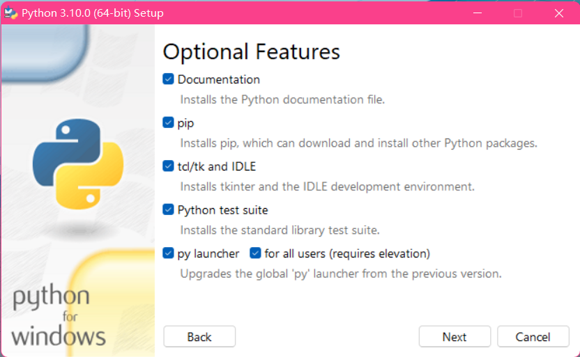
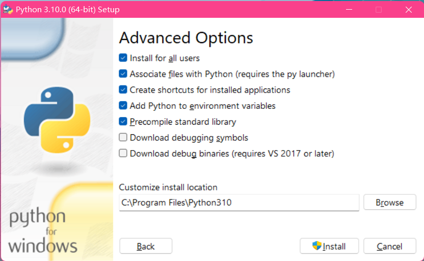
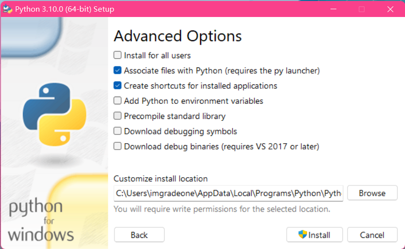
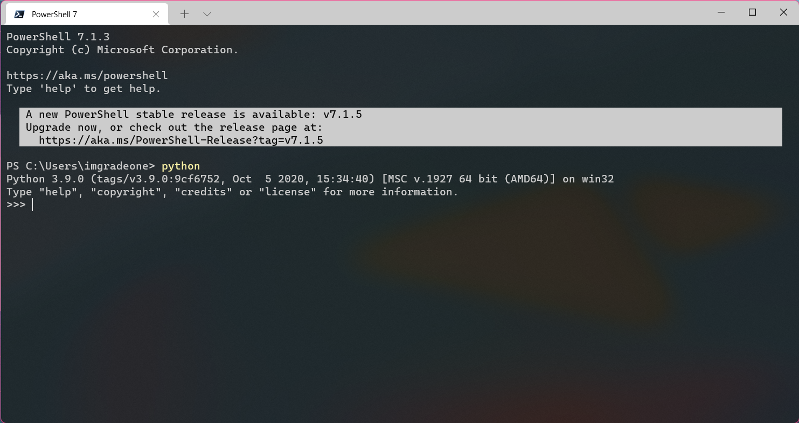
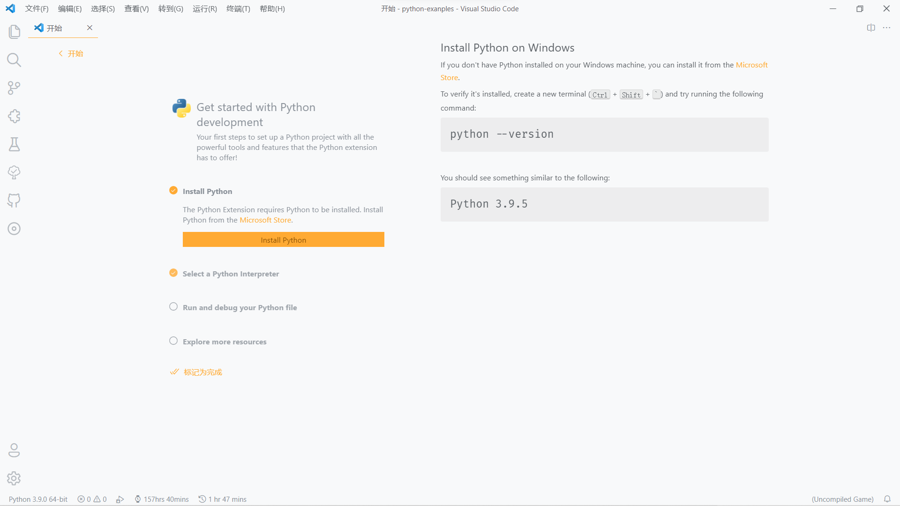
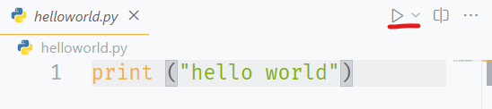
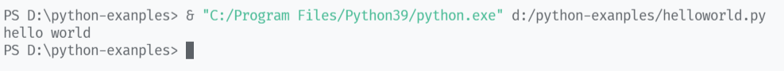

# 第 1 课：Python 入门

## 认识 Python
Python 是一种广泛使用的解释型、高级和通用的编程语言，可以应用于以下领域：

- Web 和 Internet 开发
- 科学计算和统计
- 人工智能
- 桌面界面开发
- 软件开发
- 后端开发
- 网络爬虫

Python 支持多种编程范型，包括函数式、指令式、结构化、面向对象和反射式编程。它拥有动态类型系统和垃圾回收功能，能够自动管理内存使用，并且其本身拥有一个巨大而广泛的标准库。

Python 的设计哲学（“优雅”、“明确”、“简单”）强调代码的可读性和简洁的语法，尤其是使用空格缩进划分代码块。相比于 C 或 Java，Python 让开发者能够用更少的代码表达想法。不管是小型还是大型程序，该语言都试图让程序的结构清晰明了。[^1]

[下载 Python](https://www.python.org/downloads/){ .md-button .md-button--primary }
[在淘宝 NPM 镜像源中获取](https://npmmirror.com/mirrors/python/){ .md-button }

## 安装 Python

!!! warning "注意"
    
    本文仅以 Windows 环境作为讲解，安装器截图以 Python 3.10 安装器作为示例。Linux 环境下一般使用 `python3` 命令即可调用。  
    如果您身处桂中学校云机房，Python 3.7.3（32 位）应该已经预装，但如果没有预装的话，你可以从 [Revocloud](https://rc.g1san.cn/DRs8) 获取带有补充 DLL 文件的 Python 3.7.6（32 位）。安装前请先把压缩包内的两个 DLL 文件放至 `system32` 文件夹内。  
    另外，经 [反馈](https://github.com/devswork-glzx/python-tutorial/issues/1)，由于 Python 3.10 缺失对应版本的库，请您选用 [Python 3.9.7](https://www.python.org/downloads/release/python-397/) 或更旧版本。  
    **注意！** Python 3.9 及更高版本已不再支持 Windows 7 及更旧版本的系统，如有需要，请使用 Windows 8.1 及更新的系统或下载 [Python 3.8.12](https://www.python.org/downloads/release/python-3812/)。  
    当然，你也许可以尝试一下 [Miniconda](https://conda.io/miniconda.html)，但本系列教程暂不考虑 Miniconda。

1. 从 [Python 官网](https://www.python.org/downloads/) 或 [淘宝 NPM 镜像源](https://npmmirror.com/mirrors/python/) 下载适宜的 Python 版本（如更为稳定的 3.9）。
    
    !!! danger "警告"

        我们强烈 **不建议** 从 Microsoft Store 获取 Python。虽然我们也拦不住你，但是，**最好别这么做**。  
        另外，经 [反馈](https://github.com/devswork-glzx/python-tutorial/issues/1)，由于 Python 3.10 缺失对应版本的库，请您选用 [Python 3.9.7](https://www.python.org/downloads/release/python-397/) 或更旧版本。

2. 运行安装包。您应该会看到如下界面。*请无视版本号差异。*  
    

3. 点击 `Customize installation`（自定义安装）选项。

    !!! tip "提示"

        你可以先勾选 `Add Python to PATH` 并直接开始安装，但我建议使用 `Customize installation` 选项进行自定义安装。

4. 保持 `Optional Features` 页面下的选项为全选即可，然后点击 `Next`。  
    

5. 在 `Advanced Options` 下勾选 `Install for all users`（推荐）和 `Add Python to environment variables`（必须）。其余的 `debugging tools` 按需选择，安装目录按需修改。  
    

    ??? note "查看配置前截图"
        

6. 点击 `Install` 并允许 Python 安装器使用管理员权限（若启用了 PAC），等待安装完成。
    <!-- 安装完成的截图懒得截了 xD -->

7. 安装完成后，先别急着关闭安装器，选择 `Disable path length limit` 来禁用 Windows 原本的 260 字符环境变量限制，以便日后开发。（**这一点对于前序未使用 `Install for all users` 选项的用户来说尤为重要，但无论如何，你都应该点击这个按钮。**）  

    ??? tip "如果我忘记按这个按钮了呢？"

        你可以新建一个 `.py` 文件，输入以下内容并运行该文件：
        ```py
        import winreg
        winreg.SetValueEx(winreg.CreateKey(winreg.HKEY_LOCAL_MACHINE, r'SYSTEM\CurrentControlSet\Control\FileSystem'), 'LongPathsEnabled', None, winreg.REG_DWORD, 1)
        ```

        或者，你也可以直接使用 `regedit` 编辑注册表：  
        位置：`\HKEY_LOCAL_MACHINE\SYSTEM\CurrentControlSet\Control\FileSystem`  
        名称：`LongPathsEnabled`  
        键值：`1`
        
8. 运行任意一款终端程序（cmd / PowerShell / ...），输入 `python` 命令，如果出现了类似如下界面（即 Python <版本号> 和 `>>>`），那么 Python 就安装成功并正确配置了。  
    

    !!! tip "提示"

        如果你在 Windows 系统中安装了多个 Python 环境，那么你可以使用 `py` 启动器启动相应版本的 Python，例如：

        ```sh
        # 启动 Python 3
        py -3
        # 启动 Python 3.9
        py -3.9
        # 列出所有已安装的 Python 及其对应目录
        py -0p 
        py --list-paths
        ```

## 选择文本编辑器或 IDE

对于初学者，我们建议您使用基本的文本编辑器来简单地编辑 Python 脚本文件。在此我将推荐部分编辑器：

- [Visual Studio Code](https://code.visualstudio.com) + [Python 插件](https://marketplace.visualstudio.com/items?itemName=ms-python.python) - 美观现代的代码编辑器，但 **不适合学校云机房使用**。
- [Notepad3](https://www.rizonesoft.com/downloads/notepad3/) - 轻量简单的文本 / 代码编辑器，适合轻度 Python 代码编写，**适合在学校云机房使用**。
- Python IDLE - Python 预装的编辑器，功能简单，调试功能偏弱，但轻量。
- [Sublime Text](https://www.sublimetext.com) - 简单强大的编辑器，**但该软件本质上为付费软件**。

??? tip "对于有经验者"

    如果你已经有一定经验，你可以试试这些编辑器和 IDE：

    - [Visual Studio](https://visualstudio.microsoft.com/zh-hans/) + Python 开发
    - [JetBrains PyCharm](https://www.jetbrains.com/zh-cn/pycharm/)

## 编写第一个 Hello World 程序
!!! help "提示"

    本系列教程将以 Visual Studio Code + Python 插件为例进行开发。对于其他编辑器，您可能需要通过命令行运行 Python 脚本。您可以查看“等一下！我使用的不是 VS Code！”部分来了解详情。

1. 启动 Visual Studio Code（或其他编辑器）。

1. 安装 [Python 插件](https://marketplace.visualstudio.com/items?itemName=ms-python.python)。如果你已经安装 Python 插件，那么打开 Python 文件后，插件会自动激活。  
你也许能看到开始页面中的 `Get started with Python development` 板块，此时 Python 插件已经可以正常使用了。  
    { loading=lazy }

1. 新建一个 Python 文件（后缀为 `.py`），输入以下内容并保存：
    ```py
    print ("hello world")
    ```

1. 点击窗口右上角的三角形播放按钮，观察下方出现的终端，它应该会输出 `hello world`。  
      
      
如果你乐意的话，你也可以在编辑区点击右键，选择 `在交互式窗口中运行当前文件`，该选项可以带来更直观的调试体验。

1. 恭喜！你已经迈出了 Python 编程的第一步了！

??? question "等一下！我使用的不是 VS Code！"

    一样没问题。你可以参考如下步骤：

    1. 同样新建一个 `.py` 文件，输入同样的代码。
    
    1. 启动终端，将目录切换到 Python 文件所在的位置。  
    例如，如果你的文件在 `D:\python-examples\helloworld.py`，那么请输入：
    ```sh
    cd D:/python-examples
    ```
    如果您无法切换到 C 盘以外的目录，请尝试使用 Windows PowerShell 或 [全新的 PowerShell 7](https://hub.fastgit.org/PowerShell/PowerShell/releases)。

    1. 输入如下命令：
    ```sh
    python helloworld.py
    # 或者
    py -3 helloworld.py
    ```

    1. 观察终端，它应该会输出 `hello world`。

    1. 大功告成！

## print 和 input

`print` 和 `input` 是 Python 中最基础的输入输出函数。

### print(*objects, sep=' ', end='\n', file=sys.stdout, flush=False)

- objects: 复数，表示可以一次输出多个对象。输出多个对象时，需要用 `,` 分隔。
- sep: 用来间隔多个对象，默认值是一个空格。
- end: 用来设定以什么结尾。默认值是换行符 `\n`，我们可以换成其他字符串。
- file: 要写入的文件对象。
- flush: 输出是否被缓存通常决定于 file，但如果 flush 关键字参数为 True，流会被强制刷新。

### input(\[prompt\])
`input` 是输入函数，使用后可以向程序内输入数据。

- prompt: 提示信息

## 尝试一下 input + print
为了让 `input` 的内容能够影响 `print` 的输出，我们将临时设置一个变量 `a`。关于变量的内容，详见 [第 2 课 变量]。

接下来，再新建一个 `.py` 文件，输入以下内容：

```py
a = input("输入内容：")
print ("输入的是 " + a)
```

运行文件，输入一些文本，观察返回的内容，然后重复运行并输入不同内容，再次观察。

[^1]: 引用自 [中文维基百科 Python 词条](https://zh.wikipedia.org/wiki/Python)。
