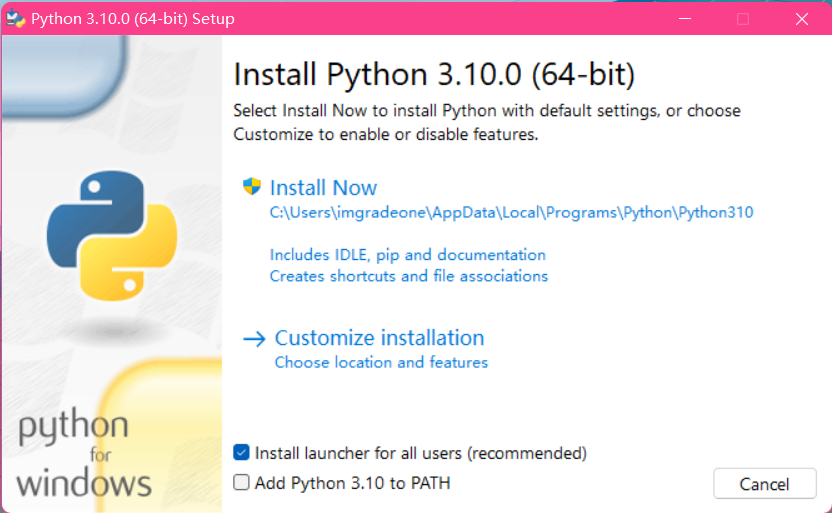

# 第 1 课：Python 入门

## 认识 Python
Python 是一种解释型脚本语言，可以应用于以下领域：

- Web 和 Internet 开发
- 科学计算和统计
- 人工智能
- 桌面界面开发
- 软件开发
- 后端开发
- 网络爬虫

Python 支持多种编程范型，包括函数式、指令式、结构化、面向对象和反射式编程。它拥有动态类型系统和垃圾回收功能，能够自动管理内存使用，并且其本身拥有一个巨大而广泛的标准库。

Python 的设计哲学强调代码的可读性和简洁的语法，尤其是使用空格缩进划分代码块。相比于 C 或 Java，Python 让开发者能够用更少的代码表达想法。不管是小型还是大型程序，该语言都试图让程序的结构清晰明了。[^1]

[下载 Python](https://www.python.org/downloads/){ .md-button .md-button--primary }
[在淘宝 NPM 镜像源中获取](https://npmmirror.com/mirrors/python/){ .md-button }

## 安装 Python

!!! warning "注意"
    
    本文仅以 Windows 环境作为讲解。Linux 环境下一般使用 `python3` 命令即可调用。  
    如果您身处桂中学校机房，Python 3.7.3（32 位）应该已经预装，

1. 从 [Python 官网](https://www.python.org/downloads/) 或 [淘宝 NPM 镜像源](https://npmmirror.com/mirrors/python/) 下载适宜的 Python 版本（如目前最新的 3.10）。

1. 运行安装包。您应该会看到如下界面。*请无视版本号差异。*
    

[^1]: 引用自 [中文维基百科 Python 词条](https://zh.wikipedia.org/wiki/Python)。